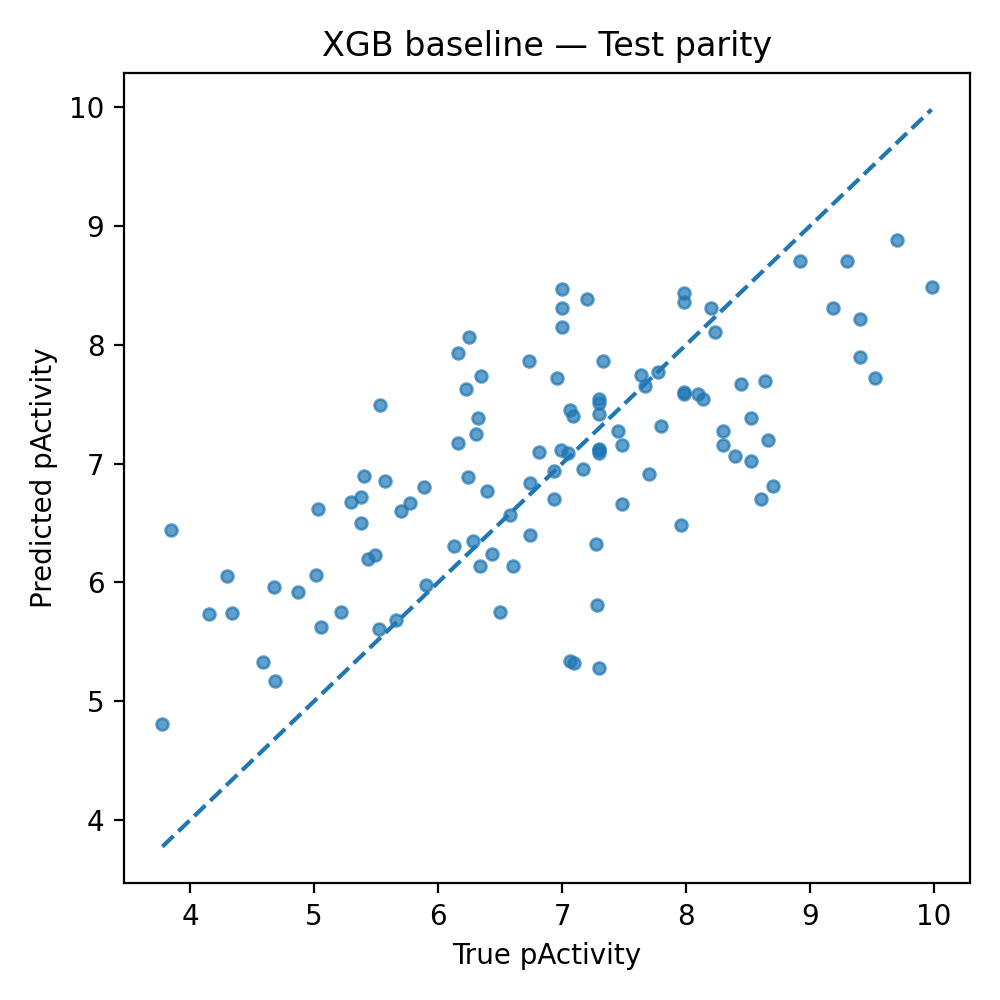
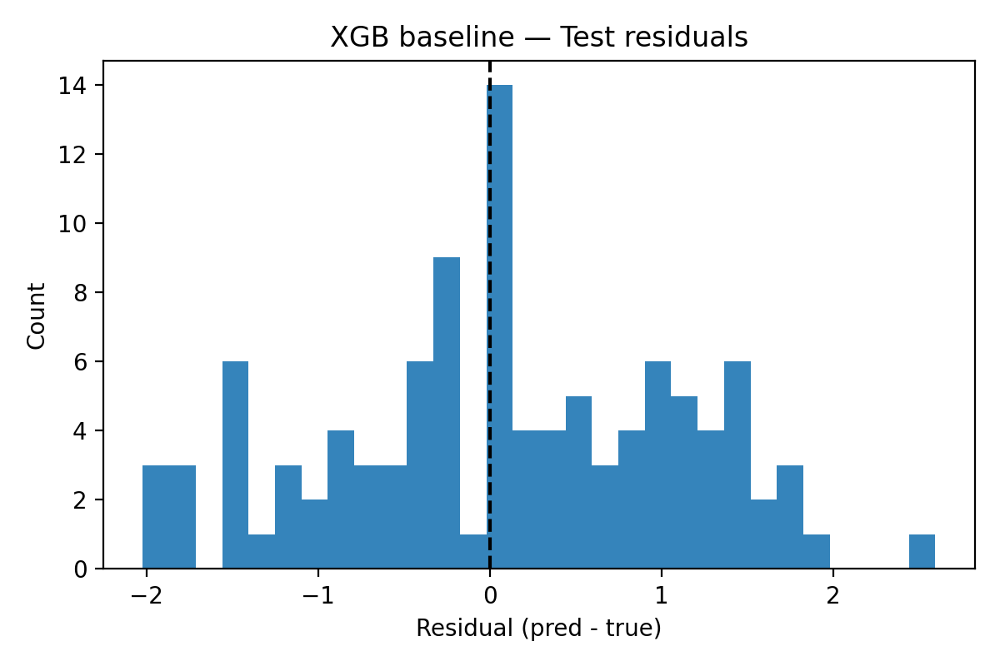
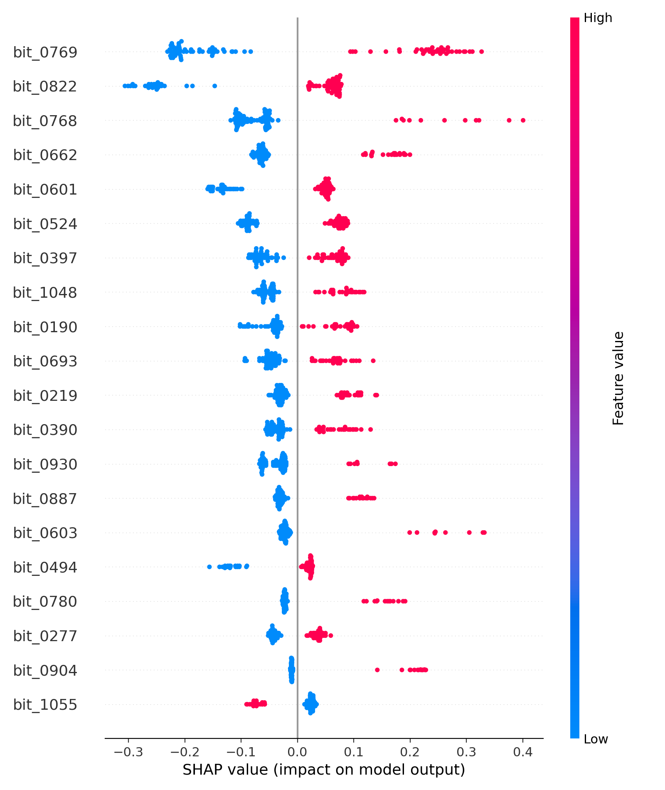
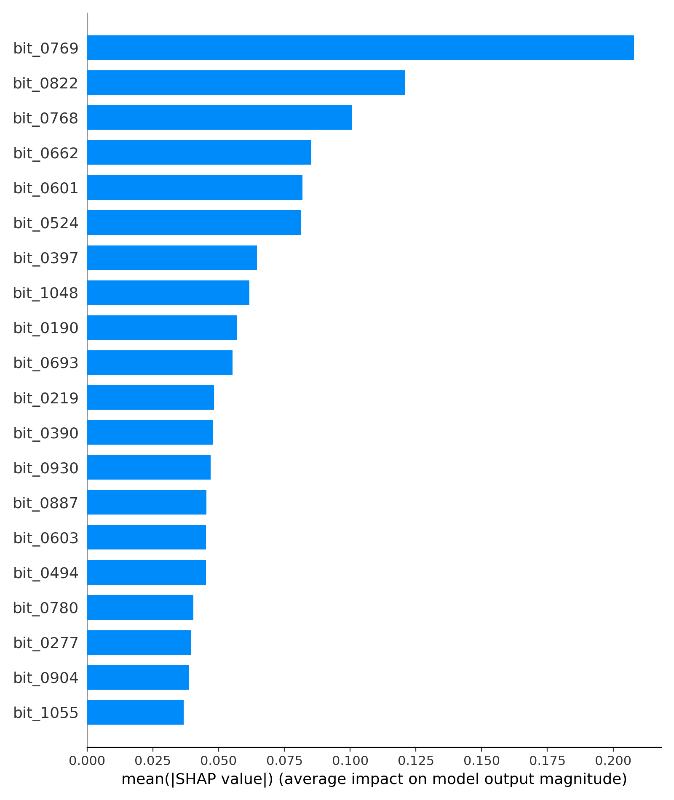
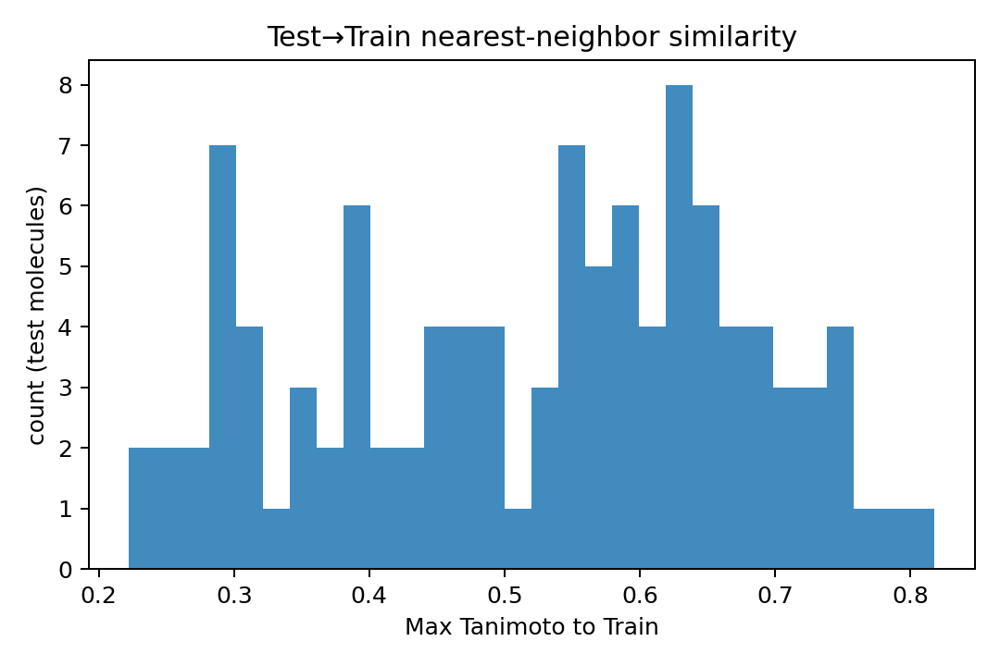

# QSAR Model Results: EGFR Inhibitor Activity Prediction

## Dataset Overview

Split Sizes
- Training Set: 796 compounds (79.6%)
- Validation Set: 98 compounds (9.8%)
- Test Set: 106 compounds (10.6%)
- Total: 1,000 compounds

Data Characteristics
- Target: EGFR (Epidermal Growth Factor Receptor) inhibition
- Assay Types: IC50 (99.6%) and Ki (0.4%)
- Activity Range: pActivity values from ~4.0 to ~10.0
- Features: 1,163 Morgan fingerprints (filtered from 2,048 original features)
- Split Method: Scaffold-based splitting for realistic generalization assessment

Feature Engineering
- Original Features: 2,048 Morgan fingerprints (radius=2)
- Rare Bit Filtering: Removed 885 bits with <5 positive examples (43.2% reduction)
- Final Features: 1,163 informative molecular descriptors

## Model Performance Comparison

| Model | Split | RMSE | MAE | R² | **Key Insight** |
|-------|-------|------|-----|----|-----------------|
| **XGBoost Baseline** | Train | 0.419 | 0.319 | **0.890** | Severe overfitting |
| | Val | 1.248 | 0.944 | 0.215 | |
| | Test | 1.026 | 0.834 | **0.441** | |
| **XGBoost Optimized** | Train | 0.628 | 0.494 | **0.753** | Best overall |
| | Val | 1.188 | 0.930 | **0.288** | |
| | Test | 1.050 | 0.861 | **0.415** | |

XGBoost Optimized
Best Test R²: 0.415 (vs 0.441 baseline)
Best Generalization: Reduced overfitting compared to baseline
Most Robust: Consistent performance across all splits

## Model Analysis

Overfitting Assessment:
XGBoost Baseline: Train-Val R² gap = 0.675 
XGBoost Optimized: Train-Val R² gap = 0.465 

Scaffold Split:
Test-Train Similarity: Mean Tanimoto = 0.523 (moderate similarity)
Novel Scaffolds: Test set contains unseen molecular scaffolds
Generalization: XGBoost handles scaffold diversity well

Feature Efficiency:
Rare Bit Removal: 43.2% feature reduction with maintained performance
Information Density: 1,163 features for 796 training samples (1.5:1 ratio)
Noise Reduction: Filtering improved model stability

## Model Performance Plots

*Predicted vs Actual pActivity values for test set*

*Residual analysis showing prediction errors distribution*

*SHAP values showing feature contributions for validation set*

*Most important molecular features ranked by SHAP importance*

*Distribution of pActivity values across train/val/test splits*

*Maximum Tanimoto similarity between test and training compounds*

## Worst Prediction Errors

Training Set - Top 5 Worst Errors:

| Error | True | Pred | SMILES | Scaffold | Assay |
|-------|------|------|--------|----------|-------|
| 2.115 | 4.002 | 6.117 | `O=C(Nc1cnn(-c2ccccc2)c1)c1ccc(NS(=O)(=O)c2ccc(Cl)cc2)cc1` | `O=C(Nc1cnn(-c2ccccc2)c1)c1ccc(NS(=O)(=O)c2ccccc2)cc1` | IC50 |
| 1.996 | 9.610 | 7.614 | `C=CC(=O)N1CCC(Oc2nc(Nc3ccc(N4CCN(C)CC4)cc3OC)nc3[nH]ccc23)CC1` | `c1cc2c(OC3CCNCC3)nc(Nc3ccc(N4CCNCC4)cc3)nc2[nH]1` | IC50 |
| 1.852 | 8.886 | 7.034 | `CS(=O)(=O)CCNCc1ccc(-c2ccc3ncnc(Nc4ccc(OCc5ccccc5)cc4)c3c2)o1` | `c1ccc(COc2ccc(Nc3ncnc4ccc(-c5ccco5)cc34)cc2)cc1` | IC50 |
| 1.847 | 4.523 | 6.370 | `CN1CCC(NC(=O)c2cnc(Nc3cc(Cl)cc(Cl)c3)nc2NC2CCC(N(C)C)CC2)CC1` | `O=C(NC1CCNCC1)c1cnc(Nc2ccccc2)nc1NC1CCCCC1` | IC50 |
| 1.710 | 9.658 | 7.947 | `CCOc1cc2ncc(C#N)c(Nc3ccc(OCc4ccccc4)c(Cl)c3)c2cc1NC(=O)/C=C/CN1CCCCC1` | `O=C(/C=C/CN1CCCCC1)Nc1ccc2nccc(Nc3ccc(OCc4ccccc4)cc3)c2c1` | IC50 |

Validation Set - Top 5 Worst Errors:

| Error | True | Pred | SMILES | Scaffold | Assay |
|-------|------|------|--------|----------|-------|
| 3.440 | 10.000 | 6.560 | `C=CC(=O)Nc1cccc(-n2c(=O)cnc3cnc(Nc4ccc(N5CCOCC5)cc4)nc32)c1` | `O=c1cnc2cnc(Nc3ccc(N4CCOCC4)cc3)nc2n1-c1ccccc1` | IC50 |
| 3.136 | 3.884 | 7.020 | `CCOC(=O)CCCn1c(=O)oc2cc3ncnc(Nc4cccc(O)c4)c3cc21` | `O=c1[nH]c2cc3c(Nc4ccccc4)ncnc3cc2o1` | IC50 |
| 2.782 | 8.509 | 5.727 | `C=CC(=O)Nc1cccc(Nc2nc(Nc3ccc(OC)cc3OC)ncc2C(F)(F)F)c1` | `c1ccc(Nc2ccnc(Nc3ccccc3)n2)cc1` | IC50 |
| 2.718 | 8.387 | 5.670 | `N#Cc1ccc(Nc2nncc3ccccc23)cc1` | `c1ccc(Nc2nncc3ccccc23)cc1` | IC50 |
| 2.664 | 4.000 | 6.664 | `Cc1nc2cnc(Nc3ccnc(-c4cnn(S(=O)(=O)C5CC5)c4)n3)cc2n1C(C)C` | `O=S(=O)(C1CC1)n1cc(-c2nccc(Nc3cc4[nH]cnc4cn3)n2)cn1` | Ki |

Test Set - Top 5 Worst Errors:

| Error | True | Pred | SMILES | Scaffold | Assay |
|-------|------|------|--------|----------|-------|
| 2.547 | 3.843 | 6.390 | `C=CC(=O)N1CCC[C@H](n2nc(-c3ccc(Oc4ccccc4)cc3)c3c(N)ncnc32)C1` | `c1ccc(Oc2ccc(-c3nn([C@H]4CCCNC4)c4ncncc34)cc2)cc1` | IC50 |
| 2.204 | 8.699 | 6.495 | `C#Cc1cccc(Nc2ncnc3cc(OC)c(OCCCCCCCN/C(=N\C#N)Nc4cccnc4)cc23)c1` | `N=C(NCCCCCCCOc1ccc2ncnc(Nc3ccccc3)c2c1)Nc1cccnc1` | IC50 |
| 2.128 | 9.979 | 7.851 | `C=CC(=O)Nc1ccccc1C1CCNc2c(C(N)=O)c(-c3ccc(OC4CCCC4)cc3)nn21` | `c1ccc(C2CCNc3cc(-c4ccc(OC5CCCC5)cc4)nn32)cc1` | IC50 |
| 2.002 | 7.301 | 5.299 | `C=CC(=O)Nc1cccc(N2C(=O)N(Cc3ccccc3)Cc3cnc(Nc4ccc(N5CCN(C)CC5)cc4OC)nc32)c1` | `O=C1N(Cc2ccccc2)Cc2cnc(Nc3ccc(N4CCNCC4)cc3)nc2N1c1ccccc1` | IC50 |
| 1.964 | 9.523 | 7.559 | `C#Cc1cccc(Nc2ncnc3cc(OC)c(NC(=O)/C=C/CN(C)C4CC4)cc23)c1` | `O=C(/C=C/CNC1CC1)Nc1ccc2ncnc(Nc3ccccc3)c2c1` | IC50 |

Error Analysis Insights:
- Many errors involve complex nitrogen-containing rings
- Several errors are on very active compounds (pActivity > 9.0)
- Errors often occur on scaffolds not well-represented in training
- Large, branched molecules with multiple functional groups

- Morgan fingerprints may miss some 3D structural features

## Files: 

Models
- `models/xgb_baseline.json` - Baseline XGBoost model
- `models/xgb_optimized.json` - Bayesian-optimized XGBoost model

Metrics
- `metrics_xgb_baseline.json` - Baseline model performance
- `metrics_xgb_optimized.json` - Optimized model performance
- `best_params_xgb.json` - Optimal hyperparameters found

Predictions
- `predictions_xgb_baseline.csv` - Baseline model predictions
- `predictions_xgb_optimized.csv` - Optimized model predictions

Analysis
- `diagnostics.json` - Dataset analysis and split diagnostics
- `assay_mix_by_split.csv` - Assay type distribution by split

Visualizations
- `parity_test_xgb.png` - Predicted vs actual scatter plot
- `residuals_test_xgb.png` - Residual analysis plot
- `shap_beeswarm_val_xgb.png` - SHAP feature importance (beeswarm)
- `shap_summary_bar_val_xgb.png` - SHAP feature importance (bar)
- `label_hist_by_split.png` - Activity distribution by split
- `test_to_train_max_tanimoto.png` - Molecular similarity analysis

*Model Training: XGBoost with Bayesian Optimization*
*Dataset: EGFR Inhibitor Activity (ChEMBL)*
